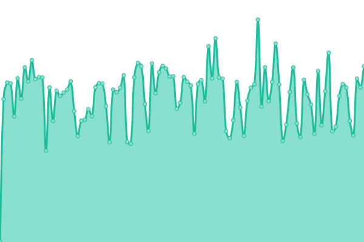
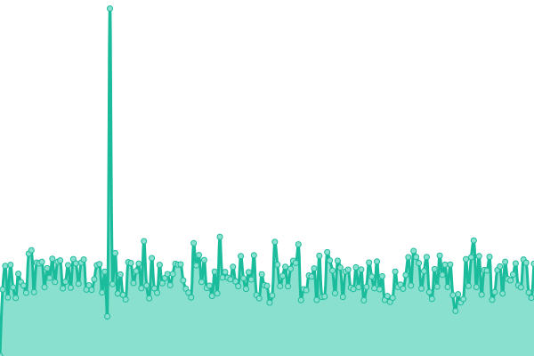
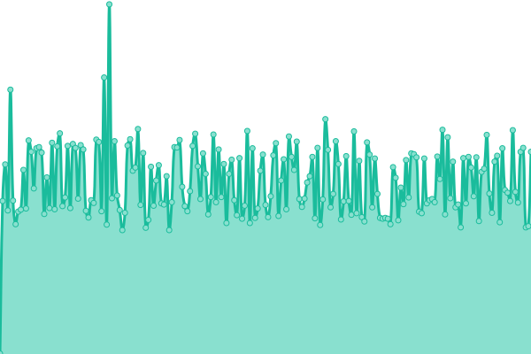
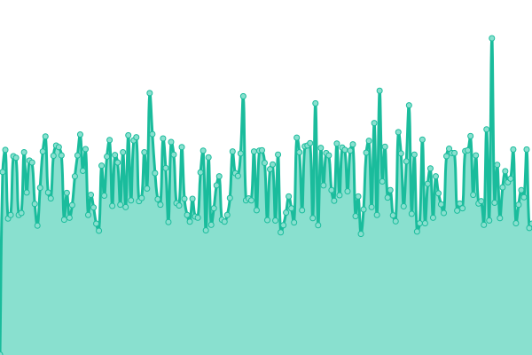
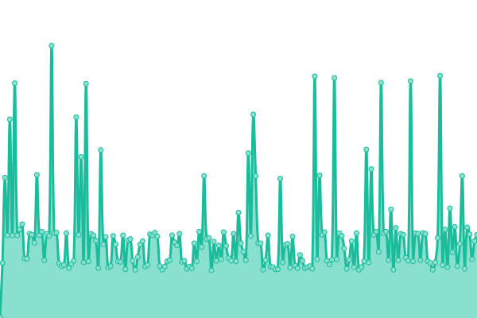
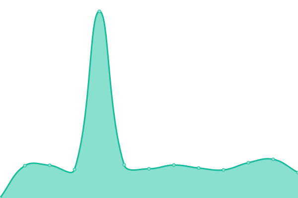

# [📈 Live Status](https://status.web1337.net): <!--live status--> **🟩 All systems operational**

<!--start: status pages-->
<!-- This summary is generated by Upptime (https://github.com/upptime/upptime) -->
<!-- Do not edit this manually, your changes will be overwritten -->
<!-- prettier-ignore -->
| URL | Status | History | Response Time | Uptime |
| --- | ------ | ------- | ------------- | ------ |
|  [jm26.net](https://jm26.net/status.txt) | 🟩 Up | [jm26-net.yml](https://github.com/JMcrafter26/status/commits/HEAD/history/jm26-net.yml) | 

 459ms
     
 | 

<a href="https://JMcrafter26.github.io/status/history/jm26-net">100.00%</a>
    

|  [games.jm26.net](https://games.jm26.net/status.txt) | 🟩 Up | [games-jm26-net.yml](https://github.com/JMcrafter26/status/commits/HEAD/history/games-jm26-net.yml) | 

 457ms
     
 | 

<a href="https://JMcrafter26.github.io/status/history/games-jm26-net">100.00%</a>
    

|  [test.jm26.net](https://test.jm26.net/status.txt) | 🟩 Up | [test-jm26-net.yml](https://github.com/JMcrafter26/status/commits/HEAD/history/test-jm26-net.yml) | 

 469ms
     
 | 

<a href="https://JMcrafter26.github.io/status/history/test-jm26-net">100.00%</a>
    

|  [socials.jm26.net](https://socials.jm26.net/status.txt) | 🟩 Up | [socials-jm26-net.yml](https://github.com/JMcrafter26/status/commits/HEAD/history/socials-jm26-net.yml) | 

 486ms
     
 | 

<a href="https://JMcrafter26.github.io/status/history/socials-jm26-net">100.00%</a>
    

|  [go.jm26.net](https://go.jm26.net/status.txt) | 🟩 Up | [go-jm26-net.yml](https://github.com/JMcrafter26/status/commits/HEAD/history/go-jm26-net.yml) | 

 464ms
     
 | 

<a href="https://JMcrafter26.github.io/status/history/go-jm26-net">100.00%</a>
    

|  [files.jm26.net](https://files.jm26.net/status.txt) | 🟩 Up | [files-jm26-net.yml](https://github.com/JMcrafter26/status/commits/HEAD/history/files-jm26-net.yml) | 

 451ms
     
 | 

<a href="https://JMcrafter26.github.io/status/history/files-jm26-net">100.00%</a>
    

|  [api.jm26.net](https://api.jm26.net/status.txt) | 🟩 Up | [api-jm26-net.yml](https://github.com/JMcrafter26/status/commits/HEAD/history/api-jm26-net.yml) | 

 451ms
     
 | 

<a href="https://JMcrafter26.github.io/status/history/api-jm26-net">100.00%</a>
    

|  [Badge API](https://api.jm26.net/badge/status.txt) | 🟩 Up | [badge-api.yml](https://github.com/JMcrafter26/status/commits/HEAD/history/badge-api.yml) | 

 393ms
     
 | 

<a href="https://JMcrafter26.github.io/status/history/badge-api">100.00%</a>
    

|  [Experimental Server](https://server.jm26.net/status.txt) | 🟩 Up | [experimental-server.yml](https://github.com/JMcrafter26/status/commits/HEAD/history/experimental-server.yml) | 

 612ms
     
 | 

<a href="https://JMcrafter26.github.io/status/history/experimental-server">89.16%</a>
    

<!--end: status pages-->

[**Visit our status website →**](https://status.web1337.net)

 📄 License

- Powered by: [Upptime](https://github.com/upptime/upptime)
- Code: [MIT](./LICENSE) © [John](https://jm26.net)
- Data in the `./history` directory: [Open Database License](https://opendatacommons.org/licenses/odbl/1-0/)

