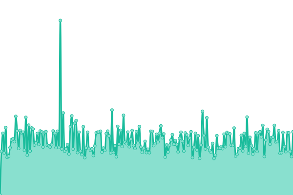

# [📈 Live Status](https://demo.upptime.js.org): <!--live status--> **🟩 All systems operational**

<!--start: status pages-->
<!-- This summary is generated by Upptime (https://github.com/upptime/upptime) -->
<!-- Do not edit this manually, your changes will be overwritten -->
<!-- prettier-ignore -->
| URL | Status | History | Response Time | Uptime |
| --- | ------ | ------- | ------------- | ------ |
|  [JM26.NET](https://jm26.net) | 🟩 Up | [jm-26-net.yml](https://github.com/JMcrafter26/status/commits/HEAD/history/jm-26-net.yml) | 

 741ms
     
 | 

<a href="https://JMcrafter26.github.io/status/history/jm-26-net">100.00%</a>
    

|  [test.jm26.net](https://test.jm26.net) | 🟩 Up | [test-jm26-net.yml](https://github.com/JMcrafter26/status/commits/HEAD/history/test-jm26-net.yml) | 

 1058ms
     
 | 

<a href="https://JMcrafter26.github.io/status/history/test-jm26-net">100.00%</a>
    

|  [go.jm26.net](https://go.jm26.net) | 🟩 Up | [go-jm26-net.yml](https://github.com/JMcrafter26/status/commits/HEAD/history/go-jm26-net.yml) | 

 842ms
     
 | 

<a href="https://JMcrafter26.github.io/status/history/go-jm26-net">100.00%</a>
    

|  [mail.jm26.net](https://mail.jm26.net) | 🟩 Up | [mail-jm26-net.yml](https://github.com/JMcrafter26/status/commits/HEAD/history/mail-jm26-net.yml) | 

 2088ms
     
 | 

<a href="https://JMcrafter26.github.io/status/history/mail-jm26-net">100.00%</a>
    

<!--end: status pages-->

[**Visit our status website →**](https://jmcrafter26.github.io/status)

## 📄 License

- Powered by: [Upptime](https://github.com/upptime/upptime)
- Code: [MIT](./LICENSE) © [John](https://jm26.net)
- Data in the `./history` directory: [Open Database License](https://opendatacommons.org/licenses/odbl/1-0/)
